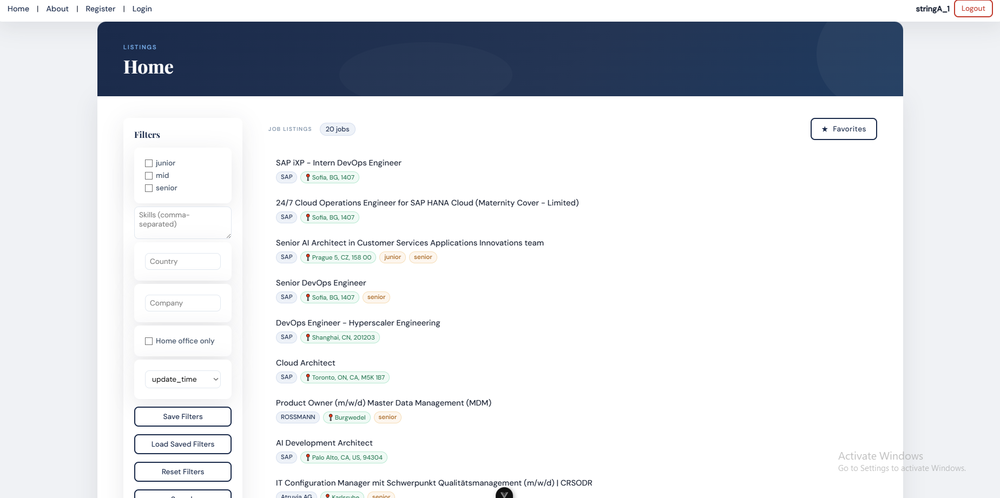
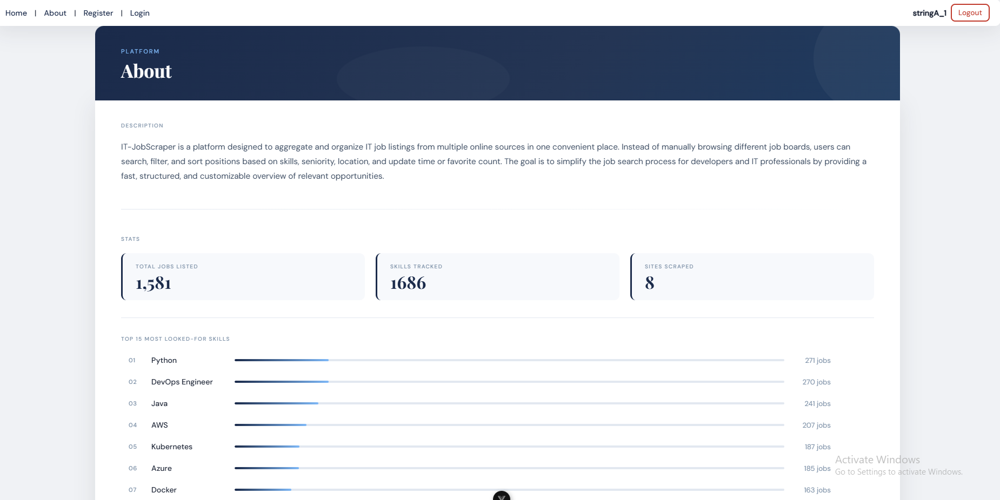
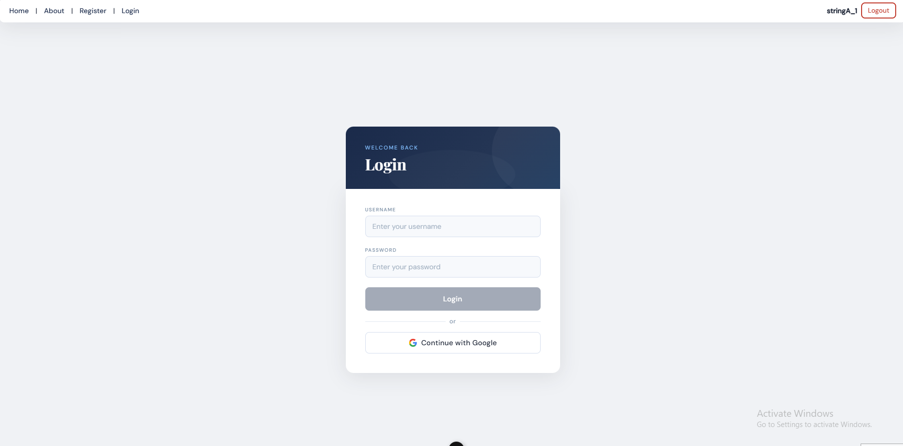
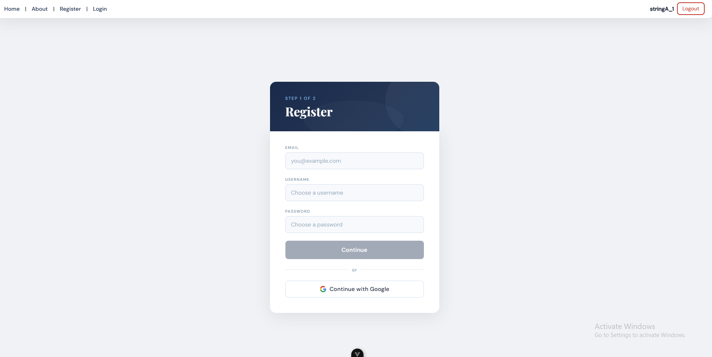
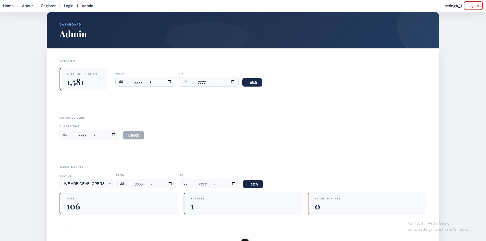
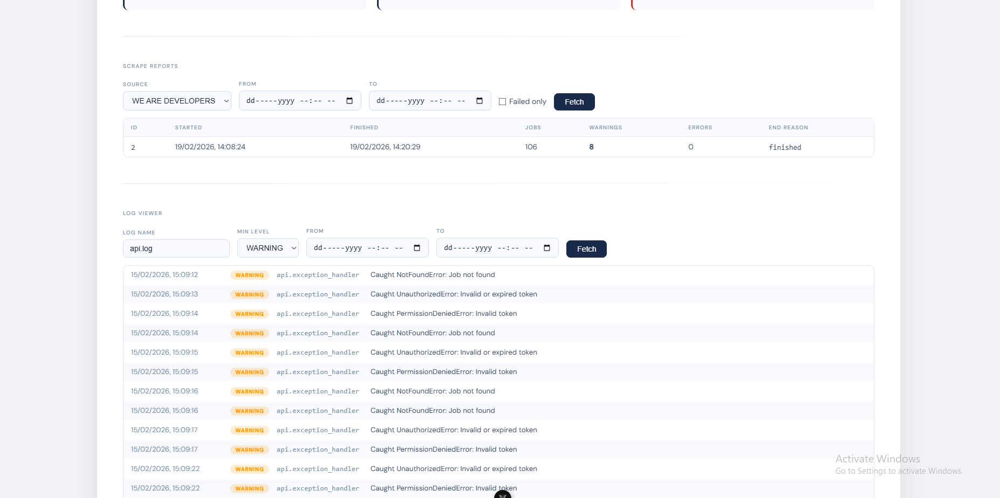

<div align="center">
    
</div>

<div align="center" style="margin-top: 10px;">
    
    
    
    <p style="margin-top: 10px;">
        <a href="#description">Description</a> •
        <a href="#why-this-project-exists">Why This Project Exists</a> •
        <a href="#features">Features</a> •
        <a href="#screenshots">Screenshots</a> •
        <a href="#tech-stack">Tech Stack</a> •
        <a href="#architecture-overview">Architecture Overview</a> •
        <a href="#project-structure">Project Structure</a> •
        <a href="#setup-guide">Setup Guide</a> •
        <a href="#contact">Contact</a> •
        <a href="#license">License</a>
    </p>
</div>

<h2 id="description">Description</h2>
<p>
    IT-JobScraper is a platform designed to aggregate and organize IT job listings from multiple online sources in one convenient place. 
    Instead of manually browsing different job boards, users can search, filter, and sort positions based on skills, seniority, 
    location, and update time or favorite count. The goal is to simplify the job search process for developers and IT professionals by providing 
    a fast, structured overview of relevant opportunities.
</p>

<h2 id="why-this-project-exists">Why This Project Exists</h2>
<ul>
    <li>To solve a real problem developers face</li>
    <li>To practice building a production-style backend architecture</li>
    <li>To deploy a containerized application behind an Nginx reverse proxy</li>
    <li>To improve my REST API development and database design skills</li>
    <li>To build a scraping pipeline using scrapy</li>
</ul>

<h2 id="features">Features</h2>
<ul>
    <li>User authentication (email/password and Google OAuth)</li>
    <li>Admin panel for insights into scrape results and gathered stats</li>
    <li>Filtering by skills, seniority, location, update/creation time, and favorite count</li>
    <li>Server-side pagination for efficient large dataset handling</li>
    <li>Frontend and API can run independently from the scraping scheduler</li>
    <li>Scheduled job scraping using Scrapy and Celery Beat</li>
    <li>Quick development setup with docker compose and Makefile</li>
    <li>Nginx reverse proxy setup for production deployment</li>
</ul>

<h2 id="screenshots">Screenshots</h2>

<div align="center">
    <h3>Home Page</h3>
    
    <h3>About Page</h3>
    
    <h3>Login Page</h3>
    
    <h3>Register Page</h3>
    
    <h3>Admin Page</h3>
    
    
</div>

<h2 id="tech-stack">Tech Stack</h2>

<h3>Infrastructure</h3>
<ul>
    <li>Docker & Docker Compose</li>
    <li>Nginx</li>
    <li>Makefile</li>
</ul>

<h3>Backend</h3>
<ul>
    <li>Python</li>
    <li>FastAPI</li>
    <li>SQLAlchemy</li>
    <li>PostgreSQL</li>
    <li>Celery</li>
    <li>Redis</li>
    <li>Scrapy</li>
</ul>

<h3>Frontend</h3>
<ul>
    <li>Vite</li>
    <li>Vue.js</li>
    <li>TypeScript</li>
    <li>HTML / CSS</li>
</ul>

<h2 id="architecture-overview">Architecture Overview</h2>
<div align="center">
    
</div>
<p>
    Job scraping is executed on a scheduled basis using Celery Beat, 
    which triggers scraping tasks at defined intervals.
</p>
<p>
    Scrapy spiders collect job listings and the data is processed in the pipeline and saved into PostgreSQL 
    using async SQLAlchemy sessions.
</p>
<p>
    The FastAPI backend exposes REST endpoints to retrieve stored 
    job listings. Redis is used to implement rate limiting for login attempts across different IP addresses.
</p>
<p>
    The scraping scheduler runs independently from the API and frontend.
    This allows the platform to continue serving users even if scraping
    tasks are temporarily disabled or being maintained.
</p>

<h2 id="project-structure">Project Structure</h2>

```
.
│
├── backend
│   ├── api/                 # FastAPI entrypoint, routes, exception handlers, rate limiter, middleware and dependencies
│   ├── core/                # Configuration, database, security, and OAuth logic
│   ├── scheduler/           # Celery Beat tasks and scheduler app
│   ├── scraping/            # Scrapy settings, pipeline, spiders and strategies
│   ├── shared/              # Shared models, schemas, utils and service logic
│   ├── logs/                # Log files for API and Scrapy
│   └── tools/               # Helper scripts (e.g., make admin, create mappings)
│
├── frontend
│   ├── src/
│   │   ├── components/      # Vue.js UI components
│   │   ├── views/           # Page views
│   │   ├── stores/          # Pinia stores
│   │   ├── router/          # Vue router
│   │   ├── services/        # Frontend API services
│   │   ├── types/           # TypeScript types
│   │   └── assets/          # CSS and static assets
│   ├── public/              # Public files like favicon
│   └── dist/                # Built frontend files
│
├── infra/                   # Docker, Docker Compose, and Nginx configs
│   ├── nginx/
│   └── docker-compose.*.yaml
│
└── resources/               # Images, banners, and diagrams
```

<h2 id="setup-guide">Setup Guide</h2>

The only prerequisite is **Docker**. Everything else is handled for you.

1. Clone the repository
2. Create a `.env.dev` file in the `/infra` directory based on the provided `.env.example`
3. Run `make` — this starts all services via Docker Compose
4. The application will be available at `http://localhost:5173`

To also run the scraping scheduler:

```bash
make infra-dev
make scheduler-dev
```


<h2 id="contact">Contact</h2>
<p>You can contact me via:</p>
<ul>
    <li>Work Email: rostislavnikolenkowork@gmail.com</li>
    <li>Personal Email: rostislav160307@gmail.com</li>
    <li>LinkedIn: <a href="https://www.linkedin.com/in/rostyslav-nikolenko-58b069348">linkedin.com/in/rostyslav-nikolenko-58b069348</a></li>
    <li>Telegram: @RSlavNV</li>
</ul>

<h2 id="license">License</h2>

This project is licensed under the MIT License. See [LICENSE](LICENSE) for details.